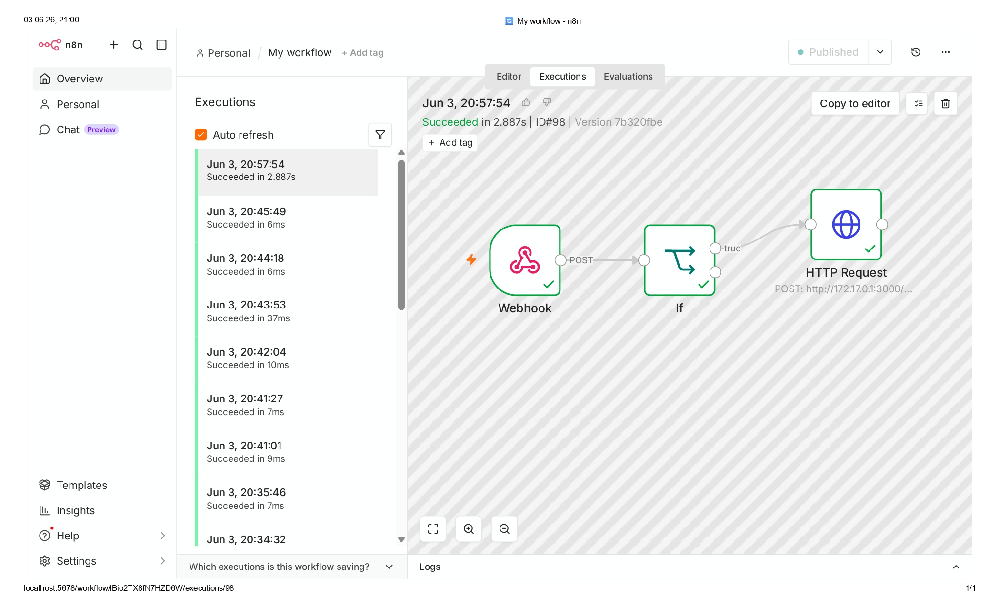

# Homelab Automation Stack

Personal infrastructure project focused on process automation,
self-hosted services and API integrations.

## Projects

### WhatsApp Automation Bot
Automated WhatsApp response system built with n8n and WAHA.
Incoming messages trigger custom workflows and return
instant replies — fully self-hosted, no third-party services.

**Stack:** n8n · WAHA · Docker · Ubuntu Server 24.04  

**Status:** ✅ Live

### Server Monitoring Dashboard
Real-time server monitoring with automated alerting.
Uptime tracking, resource usage and instant notifications
when something goes wrong.

**Stack:** Uptime Kuma · Docker · Nginx  
**Status:** 🔄 In progress

## Infrastructure
- Ubuntu Server 24.04 LTS
- Docker + Docker Compose
- Nginx reverse proxy
- Self-hosted VPS

## Skills demonstrated
- REST API integration
- Webhook-based automation
- Docker container management
- Linux server administration
- No-code / low-code workflow building (n8n)
